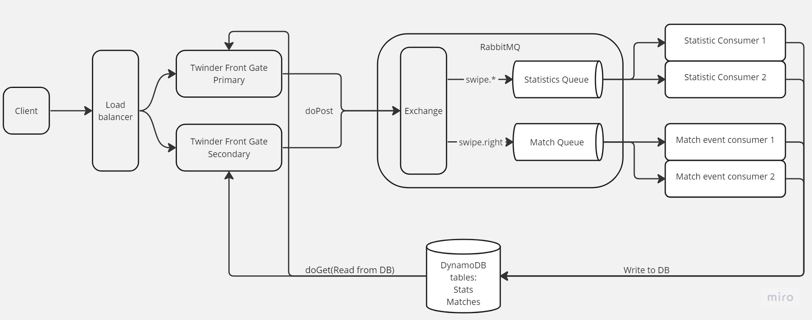
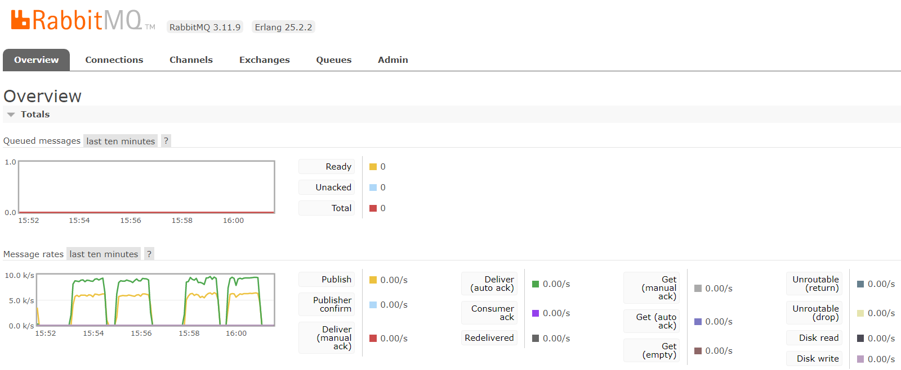
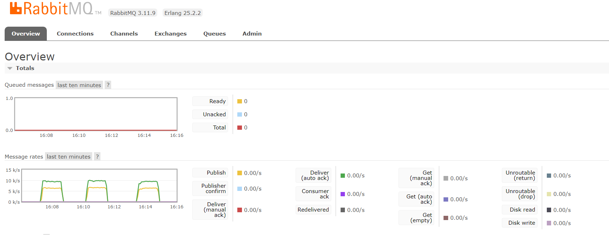
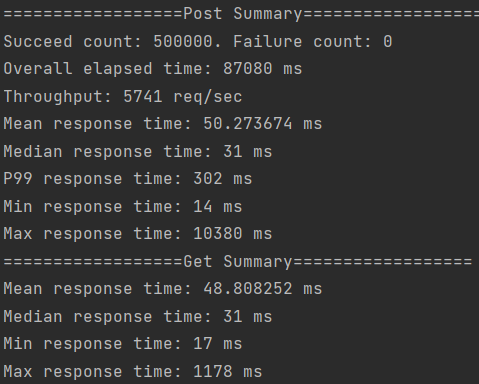
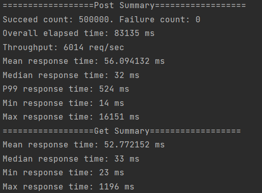
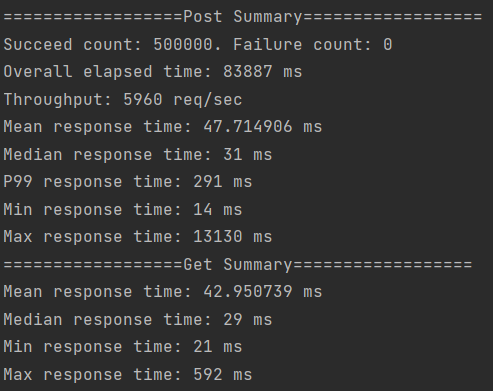

# Persistence and Reads Data

Git Repository link: [Add Data Layer](https://github.com/Jasonhaoyuan93/DistributedAndScalableSystem/tree/main/Add%20Data%20Layer)

This assignment builds on assignment 2. The main aim is to persist the swipes generated by your client and query them. The solution architecture should look something like this:

- Client as per assignment 1 to generate Swipe events ans send to server. You will also add GET requests. Details below.

- A Servlet implements doPost and writes every Swipe event to a persistent store we’ll call TempStore. This could be a persistent queue or a database table. Your choice. It must be safe - ie persistent.

- A consumer reads new Swipe events from TempStore and updates a database that stores information about users and swipe events. We’ll call this SwipeData.

- A servlet implements the GET requests and retrieves results from the SwipeData database directly. Note the /matches API only returns potential matches. You do not have to calculate actual matches.

## Architecture Solution
Here's the diagram of my architecture. Basically, I used the RabbitMQ as the TempStore and utilize dynamoDB as the database to persisted all data. The Front Gate application will query DB for all get requests while send all post requests to rabbitMQ for async process. 

- With one consumer for each queue, I've observed that requests were stacking up in the queue. My conclusion is that the additional DB persistence feature has negatively impacted the consumption rate of consumption. So I increased the number of consumers for both statistic queue and match queue. 
- Initially, I chose Mysql as DB but its write throughput is capped at around 1000 write/sec. Yet, the publishing rate requires around 9000 write/sec to keep a clear queue. So I switched to DynamoDB, where I can use on-demand read and write unit to accommodate different consumption rate. 

### Database Design
The DB structure in DynamoDB is shown below. I created two tables with respect to two GET APIs. The twinder_stats table use swipee_id as the user_id and stored number of like and dislike as attributes. The twinder_matches stored both swipee_id and swiper_id without any other attributes. 

|Table Name|Partition Key|Sort Key|Attribute 1|Attribute 2|
|----------|-------------|--------|-----------|-----------|
|twinder_stats|user_id(N)|N/A|num_like(N)|num_dislike(N)|
|twinder_matches|swipee_id(N)|swiper_id(N)|N/A|N/A|

DynamoDB is fast when searching with either partition key or sort key by default. Due to the nature of our functionality, I don't have to define additional index like mysql to boost up the performance. Partition key along with sort key composed a primary key within DynamoDB, so my twinder_match table is guarded from duplication. 

### Deployment Topology on AWS
To deploy the entire infrastructure, we need to deploy RabbitMQ first. After that, we can deploy consumer and load balancer at the same time. Finally, deploy the front gates and register them into the load balancer. 
- All EC2 instances, include Twinder Front Gates, RabbitMQ Broker, Statistic Consumers and Match Event Consumers are deployed using AWS T2.micro instances. 
- The Load Balancer type is Application LB. 
- DynamoDB is set to on-demand mode.

## Performance Analysis
I pushed 500k requests three times and obtained the following results, summarized to table below <b>(Screen shots are in the appendix section at the end)</b>: 
### Data From Assignment 3:
#### Post Summary

|Overall elapsed time(Sec)|Throughput (req/sec)|Mean response time(ms)|Median response time(ms)|P99 Response time(ms)|Min response time(ms)|Max response time(ms)|
|------------------------|--------------------|----------------------|------------------------|-----------------|---------------------|---------------------|
|87.080|5741|50.27|31|302|14|10380|
|83.135|6014|56.09|32|524|14|16151|
|83.887|5960|47.71|31|291|14|13130|

#### Get Summary
|Mean response time(ms)|Median response time(ms)|Min response time(ms)|Max response time(ms)|
|----------------------|------------------------|---------------------|---------------------|
|48.80|31|17|1178|
|53.77|33|23|1196|
|42.95|29|21|592|

The post requests took around 2 more ms than get requests on average. 

### RabbitMQ management console screenshot

The nominal publishing speed is around 6100 req/sec and the nominal acknowledgement rate is around 9200 req/sec. 

### Data From Assignment 2:
#### Post Summary
|Overall elapsed time(Sec)|Throughput (req/sec)|Mean response time(ms)|Median response time(ms)|P99 Response time(ms)|Min response time(ms)|Max response time(ms)|
|------------------------|--------------------|----------------------|------------------------|-----------------|---------------------|---------------------|
|93.863|5326|37.09|29|273|14|1636|
|98.394|5081|49.11|31|294|13|3074|
|104.583|4780|56.84|31|578|14|574

#### RabbitMQ management console screenshot

The nominal publishing speed obtain from assignment 2 is around 6000 req/sec and the nominal acknowledgement rate is around 9000 req/sec. The assignment 3's nominal throughput is similar to assignment 2's. Since we are using async process to persist DB, it is anticipated that the performance difference is negligible. 

## Appendix
### 500k requests terminal screenshots
First Trail:

Second Trail:

Third Trail:

