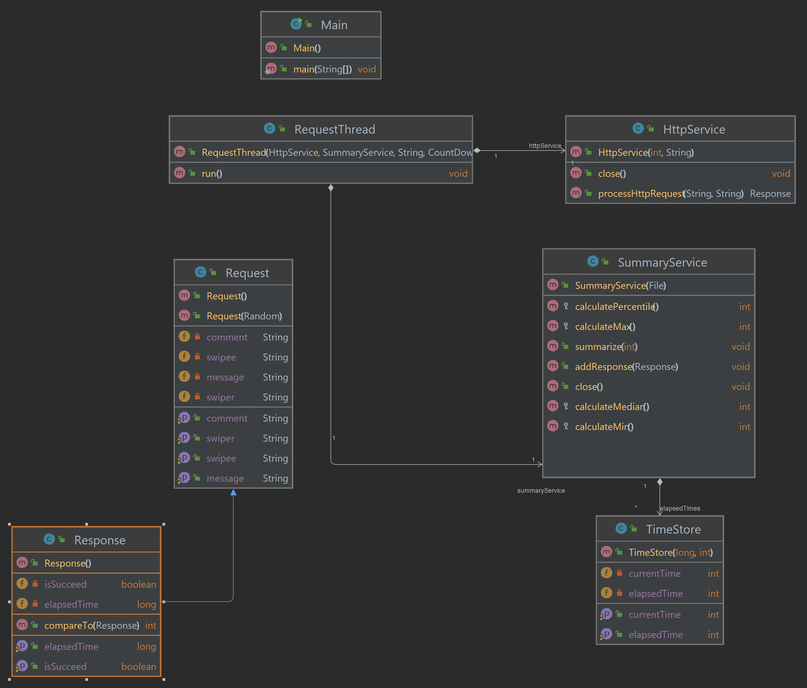
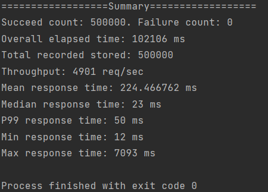

# Client
Repository link: [Concurrency&Client-server](https://github.com/Jasonhaoyuan93/DistributedAndScalableSystem/tree/main/Concurrency%26Client-server)
## Client Description

### Execute instructions

Both part 1 and part 2 can be executed with the same instructions below. To execute this application from IDE, you can create a "Run Configuration". 
In Intellij, the run configuration needs to use JDK 17 with main class point to 
org.neu.cs6650.client.Main. Then you need to fill the CLI argument with the following 
parameters: 

    <Server_ip> <Thread_pool_size> <Load_size>
For example, the target server has an ip address 18.237.117.228, and we want to use 350 thread to
send 500k request. 

    18.237.117.228 350 500000

Note: thread_pool_size=350 give the best performance with around 9000~10000 req/sec.

### Major Classes, packages, relationships

Main class under org.neu.cs6650.client is the entry point of this project. 
It governs the client's life cycle. It will read 3 command line arguments,
which are server_ip, thread_pool_size and load_size. The main class inits an ExecutorService
instance with the given thread_pool_size in order to control the concurrency. 

The Main class inits a HttpService instance that contains an apache http client
with connection pool size equals thread_pool_size. The required retry is built within 
the client. This service class handles all http requests. 

A SummaryService instance is initialized by the main class to handle recording all values 
and finalizing all statistic analysis at the end.

Within Main class, it will create a number(load_size) of RequestThread instances and submit 
them into the ExecutorService instances for processing. Within a RequestThread instance, it will 
call HttpService to send one request and record the elapsedTime into a SummaryService instance.  

After all RequestInstances are submitted, main will shut down the ExecutorService and use a
CountDownLatch instance to block the process until all request are processed. At the end of 
main, the SummaryService instance will perform statistic analysis and print out the result
to console.

All model classes are within org.neu.cs6650.model package and all service classes are within
org.neu.cs6650.service package. 

### UML Document

## Client statistics
### Part 1
Running client with 350 threads and 350 HTTP connections. Here's the example screen shot:

### Part 2
Running client with 350 threads and 350 HTTP connections. Here's the example screen shot:

Statistics for multiple trails: 

|Overall elapsed time(Sec)|Throughtput (req/sec)|Mean response time(ms)|Median response time(ms)|P99 Response time(ms)|Min response time(ms)|Max response time(ms)|
|------------------------|--------------------|----------------------|------------------------|-----------------|---------------------|---------------------|
|51.976|9801|236.24|32|254|13|8059|
|55.230|9053|238.55|31|257|12|11548|
|53.468|9351|237.31|31|240|13|15131|
|52.722|9483|236.81|31|76|12|15158|
|53.019|9430|237.01|30|78|12|15146|
|51.595|9690|236.01|30|72|13|15171|

## Performance Plot

## Spring boot result
Here's performance when I use spring boot to build the remote server. 

Spring boot performance result is similar to the performance result when I use 120 threads in 
my local client with customized servlet on remote server. Here's my client's performance result with 
120 threads:

