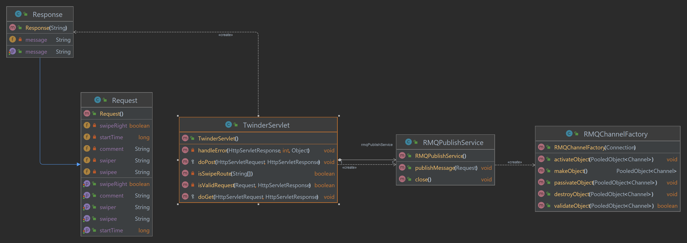
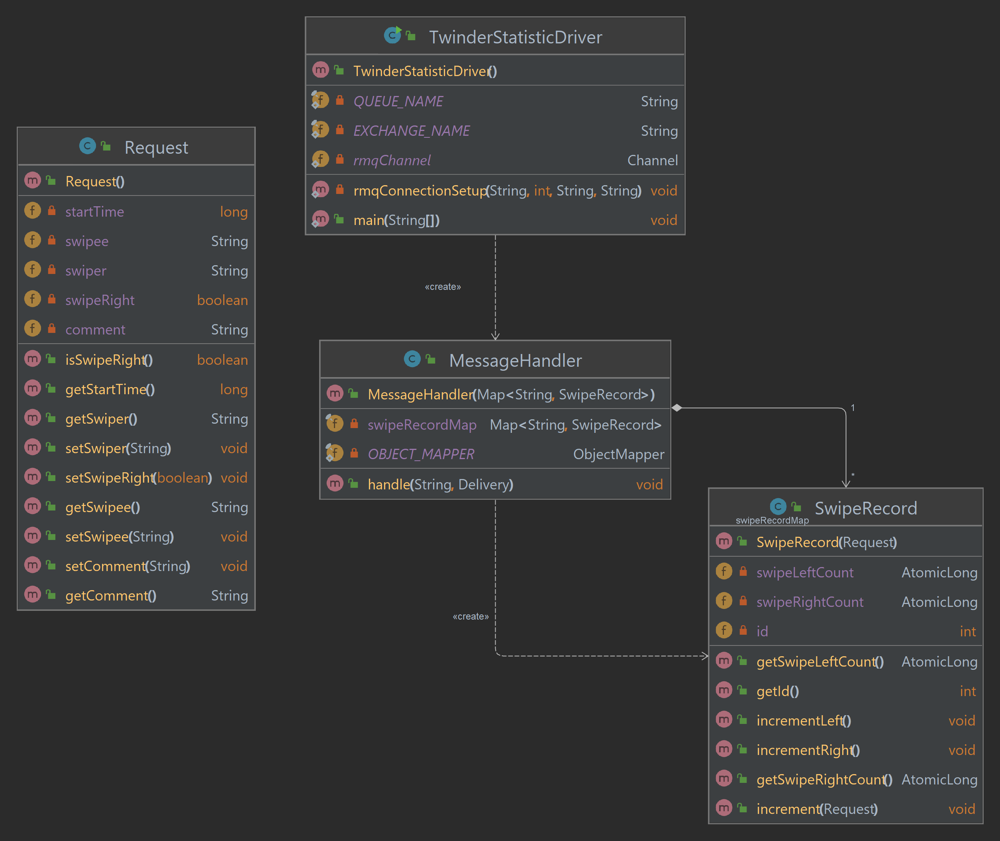
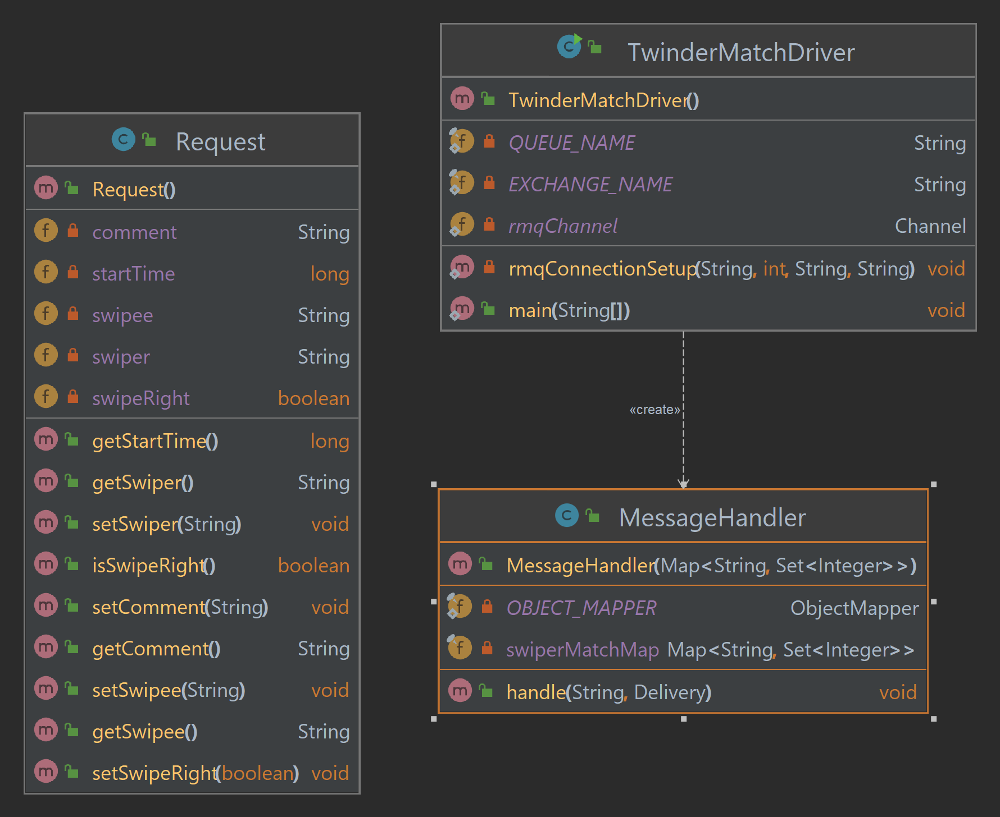
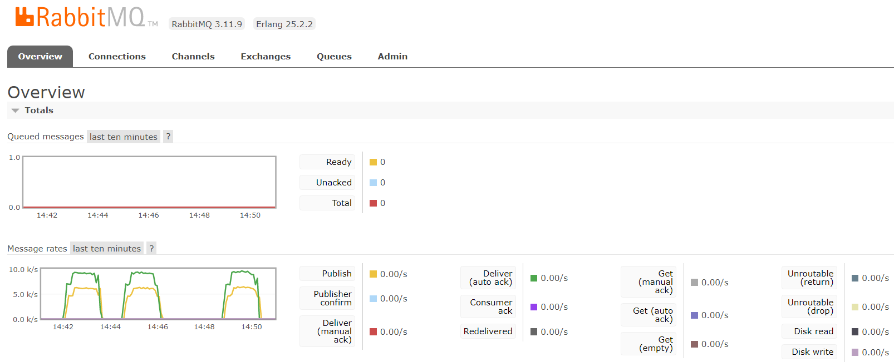
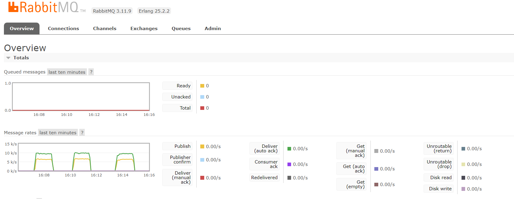

# Build Distributed Services

 Implement simple business logic in Twinder server and post the result to a RabbitMQ queue for subsequent consumption and processing. 

 Git Repository link: [Build Distributed Services](https://github.com/Jasonhaoyuan93/DistributedAndScalableSystem/tree/main/DistributedServer)

## Description

### Server: Twinder Front Gate
The Twinder Front Gate is a java application with an HTTP servlet exposed to internet. It will receive message from servlet and then deserialize the message into POJO and then apply some business logic. The business logic here is simple, just check the input URL and generate routing key for the next step. The routing key will be in format of "swipe.{left/right}". Then, the POJO object is serialized and sent to a RabbitMQ Topic Exchange(SwipeEventExchange) with the generated routing key. This application is supposed to be deploy to servlet container like Tomcat, Nginx etc.. Here's a UML for the application with all major classes: 

The RMQPublishService class contain a channel pool with maximum 200 channels within an RabbitMQ exchange. The channels are supplied with RMQChannelFactory class. One TwinderFrontGate application only contain one RMQPublish Service. 

Request class is the POJO that message deserialized to. Response class is the response body back to client.

#### Execution Instructions
- Update RabbitMQ Credentials within RMQPublishService's constructor.
- Build a War with the source code
- Deploy war to server

### Consumer: Twinder Swipe Statistics Service
The Twinder Swipe Statistics application is a consumer application that store number of likes and dislikes a user has swiped. This app will create a RabbitMQ queue(SwipeStatisticsQueue) and subscribe it into the RabbitMQ Exchange(SwipeEventExchange) with routing key = "swipe.*". The application will consume requests within the queue and stored it in a thread safe data structure(concurrent hashmap). Here's the UML of the application with all classes: 

The TwinderStatisticDriver class is the entry point of this application. It will initialize RabbitMQ Connection and create a channel associate with the connection. Also, it will create a number of RabbitMQ consumer threads to process the requests. 

The MessageHandler class implements DeliverCallback interface, which is required by RabbitMQ consumer interface. Its "handle" API within act as the call back function that consume the request when received. The concurrent hashmap that store all data is located within the MessageHandler class and it is accessible within the handle function. SwipeRecord class is a simple POJO to store like and dislike counts and they are implemented with Atomic data type to ensure thread safety. 

Request class is the POJO that request from RabbitMQ deserialized to.

<i><b>Note</b>: Consumer thread creation is done by invoking RabbitMQ.channel.basicConsumer interface repeatedly with the same MessageHandler instant. Thus, there's no thread pool creation.</i>

#### Execution instructions
- Build source code into a jar with main class point to TwinderStatisticDriver class. 
- Execute jar with following command: 

        java -jar TwinderSwipeStatistics.jar <RabbitMQ_hostname> <RMQ_routing_key> <prefetch_count> <consumer_thread_count> <RMQ_username> <RMQ_password>

        #Example:
        java -jar TwinderSwipeStatistics.jar 54.218.62.38 swipe.* 20 16 username password

        #So far, the example setup haven't meet any performance bottle neck for publishing rate below 8000 req/sec

### Consumer: Twinder User Match Service
The Twinder User Match application is a consumer application that store the first 100 users that the user has swiped right on. This app will create a RabbitMQ queue(SwipeStatisticsQueue) and subscribe it into the RabbitMQ Exchange(SwipeEventExchange) with routing key = "swipe.right". The application only consume swipe right requests within the queue and stored it in a thread safe data structure(concurrent hashmap). Here's the UML of the application with all classes: 

The TwinderUserMatchDriver class is the entry point of this application. It will initialize RabbitMQ Connection and create a channel associate with the connection. Also, it will create a number of RabbitMQ consumer threads to process the requests. 

The MessageHandler class implements DeliverCallback interface, which is required by RabbitMQ consumer interface. Its "handle" API within act as the call back function that consume the request when received. The concurrent hashmap that store all data is located within the MessageHandler class and it is accessible within the handle function.

Request class is the POJO that request from RabbitMQ deserialized to.

<i><b>Note</b>: Consumer thread creation is done by invoking RabbitMQ.channel.basicConsumer interface repeatedly with the same MessageHandler instant. Thus, there's no thread pool creation.</i>

#### Execution instructions
- Build source code into a jar with main class point to TwinderStatisticDriver class. 
- Execute jar with following command: 

        java -jar TwinderUserMatch.jar <RabbitMQ_hostname> <RMQ_routing_key> <prefetch_count> <consumer_thread_count> <RMQ_username> <RMQ_password>

        #Example:
        java -jar TwinderUserMatch.jar 54.218.62.38 swipe.right 20 16 username password

        #So far, the example setup haven't meet any performance bottle neck for publishing rate below 8000 req/sec

### Consumer Optimized Setup
The optimized setup I found was using 16 threads(consumers) with prefetch count equals to 20 in one consumer App.

## Load Testing Results

### Single Servlet Test
Sending 500k requests to one TwinderFrontGate server instance

<b>Client command line metrics:</b>

|Overall elapsed time(Sec)|Throughput (req/sec)|Mean response time(ms)|Median response time(ms)|P99 Response time(ms)|Min response time(ms)|Max response time(ms)|
|------------------------|--------------------|----------------------|------------------------|-----------------|---------------------|---------------------|
|113.481|4406|44.51|36|219|15|5026|
|109.521|4565|42.92|36|216|15|1759|
|105.127|4756|41.04|37|142|15|1665|

<b>RabbitMQ management console screenshot:</b>

Publish rate is around 5200 req/sec. Acknowledgement rate is around 7800 req/sec.

### Load Balanced Servlet Test
Sending 500k requests to a TwinderFrontGate load balancer which has two TwinderFontGate server instances sitting behind. 

<b>Client command line metrics</b>: 

|Overall elapsed time(Sec)|Throughput (req/sec)|Mean response time(ms)|Median response time(ms)|P99 Response time(ms)|Min response time(ms)|Max response time(ms)|
|------------------------|--------------------|----------------------|------------------------|-----------------|---------------------|---------------------|
|93.863|5326|37.09|29|273|14|1636|
|98.394|5081|49.11|31|294|13|3074|
|104.583|4780|56.84|31|578|14|5745|

<b>RabbitMQ management console screen shot</b>

Publish rate is around 6300 req/sec. Acknowledgement rate is around 9400 req/sec.

#### Analysis: 

I've investigated the reason why I'm not seeing a significant increase with multiple FrontGate instances. I've tried to invoke client publishing script on multiple machines under the same network but the result stays similar. I think the cap is caused by my upload bandwidth because I observed noticeable decrease in throughput when I try to publish on one machine while having a zoom meeting on another machine. 